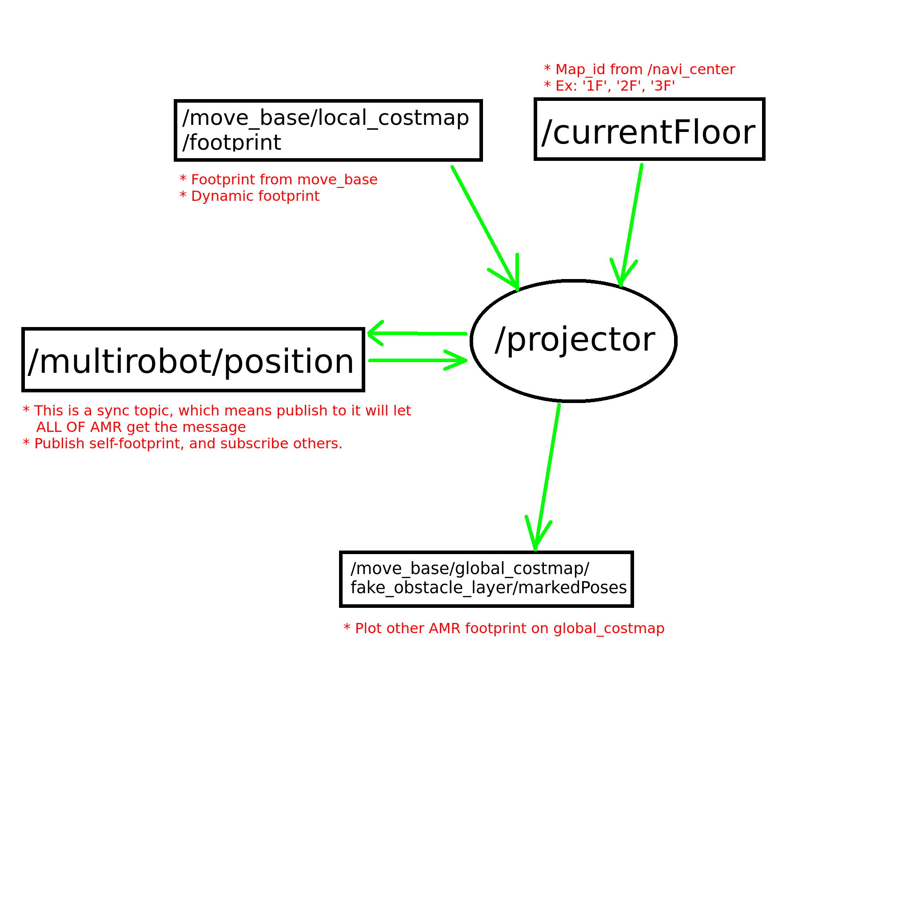

# multirobot_costmap_projector
This is the repository for projecting robots contours onto the costmap of each robots.


# Node and Topics 


# Usage 
To execute projector: 
```
$ roslaunch multirobot_costmap_projector.launch
```

